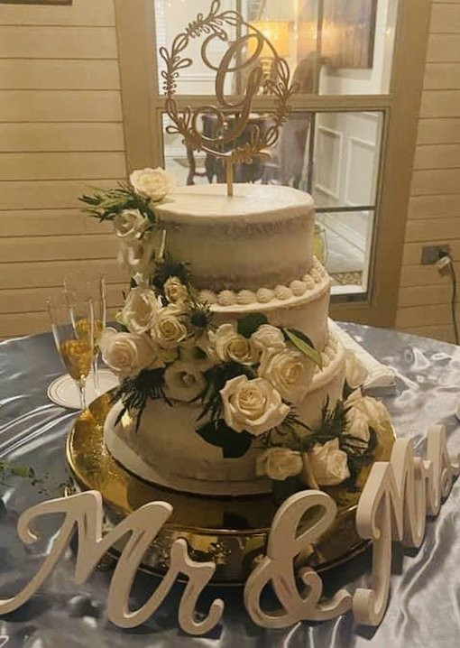
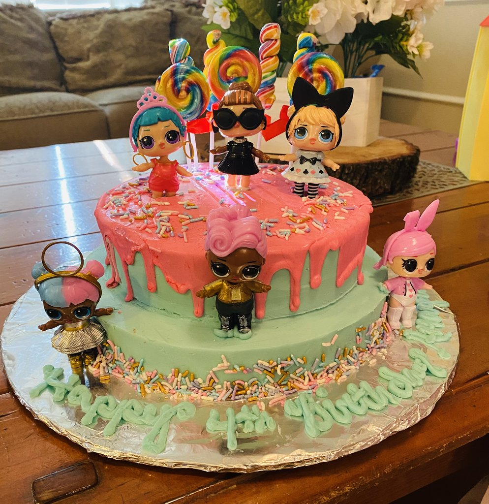
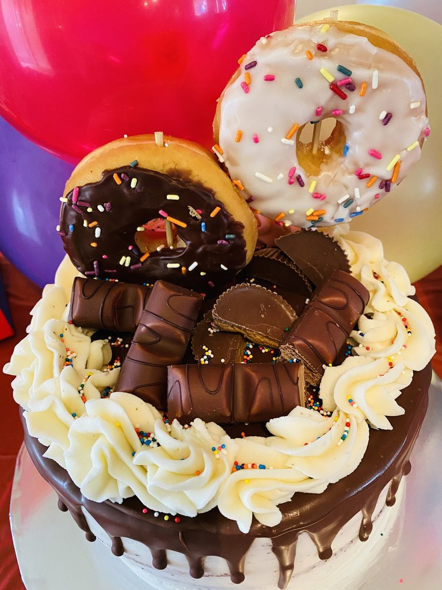
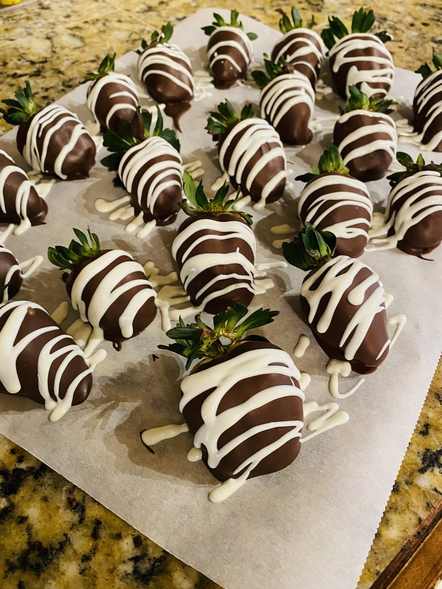
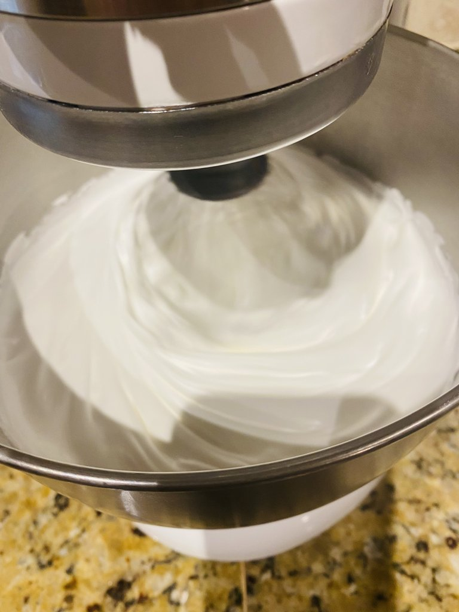

    <section>
        <h2>Weddings</h2>
        
        
 You only get so many weddings in your life, and a big part of them is the cake. Make your next wedding more special than the last with a beautiful, custom design.

    </section>

    <section>
        <h2>Birthdays</h2>
        
        
Birthdays are important. Whether you are celebrating your partner's birthday, your child's, your dog's, or you are just a very sad person ordering a cake for your own birthday, I can make a special cake for the special day. From small cupcakes to a cake big enough to hold all of <strong>my</strong> candles, it'll be the highlight of any celebration.

    </section>

    <section>
        <h2>Special occasions</h2>
        
        
Office party? Sportsball win? A six-foot-long penis cake for a bachelorette party? I can do that too.

    </section>

    <section>
        <h2>Not cakes</h2>
        
        
Chocolate covered strawberries. Giant cookies. Muffins. Pizza. Well, maybe not pizza, but I can decorate a giant cookie to look like a pizza, if that's your thing.

    </section>

    <!-- <section> -->
    <!--     <h2>About me</h2> -->
    <!--     <!-1-  -1-> -->
    <!--      -->
    <!--     
 -->
    <!--     I learned to bake and decorate during the great depression and have been -->
    <!--     honing my craft since then. -->
    <!--     
 -->
    <!--     
 -->
    <!--     Hi there! My name is Tina Orosco. I live in San Antonio Tx, I’m an associate -->
    <!--     Pastor’s wife, mother of 5 and 4 bonus children, grandma to 7 beautiful -->
    <!--     grandchildren and one on the way. I have had a passion for baking as far as -->
    <!--     I can remember. Baking sparked this joy inside of me that I couldn't get -->
    <!--     enough of. It's hard to explain, but I think anyone out there who loves -->
    <!--     baking knows what I mean. Back in the early 90’s I got my first job in a -->
    <!--     bakery at Safeway and that’s when my passion grew not only for baking but -->
    <!--     for cake decorating. I would watch the cake decorators decorate cakes and -->
    <!--     was amazed at how beautiful the cakes looked. That’s when I started teaching -->
    <!--     myself I learned really quickly and before I knew it I was working as head -->
    <!--     cake decorator not only for Safeway but for several different bakeries. When -->
    <!--     I was not working as a decorator I still made cakes on the side for family -->
    <!--     and friends birthdays, weddings and other special occasions. I have been -->
    <!--     decorating and baking for more than 31 years and still enjoy learning, there -->
    <!--     are so many new cakes I would love to make. Decorating to me is a work of -->
    <!--     art and very fulfilling. I’m thankful that God has given me this passion and -->
    <!--     talent to spread joy with my cakes. -->
    <!--     
 -->
    <!-- </section> -->

